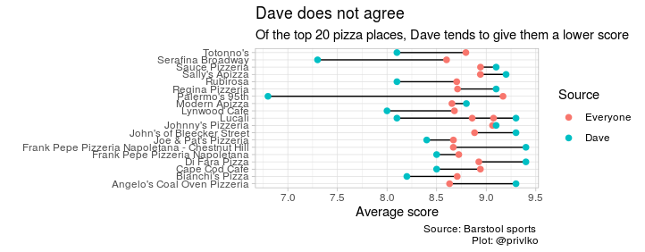
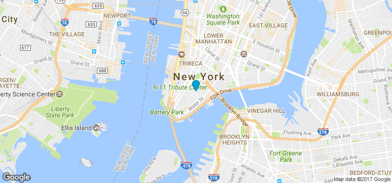

```{r setup, include=FALSE}
knitr::opts_chunk$set(echo = FALSE)
```

## Data Set and TidyTuesday Selection

https://github.com/Privlko/tidytuesday/blob/master/2019/week%2040/pizza%20party.R 


## What's Good:

- The image clearly labels what is shown
- It uses different colors to separate the two different values being compared
- Connects the two values to show difference in an easily - digestible way
- Uses a horizontal bar graph format


## What's Bad:
- Graph is unordered and the title for the graph is unwieldy
- The dots for the values can be difficult to read initially
- Fails to capture the multi-dimensionality of the dataset
- Lacks context:
- Location, Cost, etc.


## Proposed Plot
Most Popular Pizza Places in NYC
```{r, echo = FALSE, warning=FALSE,message=FALSE}
library(tidyverse)
library(ggplot2)

#read in datasets
pizza_jared <- readr::read_csv("https://raw.githubusercontent.com/rfordatascience/tidytuesday/master/data/2019/2019-10-01/pizza_jared.csv")
pizza_barstool <- readr::read_csv("https://raw.githubusercontent.com/rfordatascience/tidytuesday/master/data/2019/2019-10-01/pizza_barstool.csv")
pizza_datafiniti <- readr::read_csv("https://raw.githubusercontent.com/rfordatascience/tidytuesday/master/data/2019/2019-10-01/pizza_datafiniti.csv")

#credit:
#https://www.rdocumentation.org/packages/d3heatmap/versions/0.6.1.2/topics/d3heatmap
#https://www.data-to-viz.com/graph/heatmap.html
library(d3heatmap)
library(plotly)
pizza <- pizza_barstool %>%
  filter(city== c('Bronx','Brooklyn','New York'))%>% 
  arrange(desc(review_stats_all_average_score),
          name) %>%
  select(-address1, -longitude, -latitude, -city, -country,-zip) %>%
  head(20)
pizza <- data.frame(pizza, row.names = "name")

library(RColorBrewer)
HeatMap <- d3heatmap(pizza, scale='column', Rowv = TRUE,
            colors='YlGnBu',show_grid=TRUE,
          cexRow=.4, cexCol = .5,anim_duration = 5)

HeatMap

```

## Shiny Idea




## Shiny Idea

Using 'formattable' to create an interactive table
```{r, echo=FALSE, warning=FALSE,message=FALSE}
library('formattable')
#credit: Tim Bock
#https://www.displayr.com/formattable/
#slide 6 from MULTIDIMENSIONAL & DIMENSIONALITY REDUCTION class on 10/14
F.Table <- formattable(pizza_barstool, list(
  price_level = color_tile("green", "red"),
  provider_rating = formatter("span", style = x ~ ifelse(x >= 3.5, 
                                               style(color = "green", font.weight = "bold"), NA)),
  area(col = c(review_stats_all_average_score, review_stats_all_count, review_stats_all_total_score)) ~ normalize_bar("bisque", 0.2),
  area(col = c(review_stats_critic_average_score, review_stats_critic_count, review_stats_critic_total_score)) ~ normalize_bar("pink", 0.2),
  area(col = c(review_stats_community_average_score, review_stats_community_count, review_stats_community_total_score)) ~ normalize_bar("lightblue", 0.2),
  area(col = c(review_stats_dave_average_score, review_stats_dave_count, review_stats_dave_total_score)) ~ normalize_bar("lightgreen", 0.2)
))
F.Table
```

## Questions
- Comments, Questions, Suggestions

- Improve it here: https://rstudio.cloud/project/656531

- Github:https://github.com/zjserapin/Design-Contest

##Thank You!

